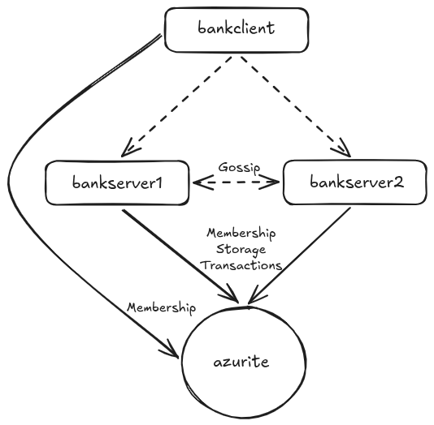

# Microsoft Orleans Bank Test

This repository contains the [Microsoft Orleans](https://github.com/dotnet/orleans) sample titled ["Orleans Bank Account with ACID transactions"](https://github.com/dotnet/samples/tree/main/orleans/BankAccount) modified to test Orleans's atomicity guarantee using [Antithesis](https://antithesis.com/).

This "Bank Test" is intended to be as simple as possible while retaining the capability to test Orleans's atomicity guarantee. To simplify the design:
- `Bank.Grains/AccountGrain.cs` was modified to allow an account to have a negative balance. That simplification allows the bank to start with a total balance of $0 across all accounts.
- Because we are only testing atomicity, we can do so with exactly 2 accounts. The test repeatedly, and often in parallel using an [Antithesis parallel driver command](https://antithesis.com/docs/test_templates/test_composer_reference/), transfers $1 from account #0 to account #1.
- `Bank.Interfaces/IAccountGrain.cs` was modified to return an account's balance after `Deposit` and `Withdraw`. `Bank.Interfaces/ITellerGrain.cs` was modified to return the balance of participating accounts after a transfer between those accounts. These changes, combined with the others, allows the test to assert the bank's total balance is $0 after every transfer.

There are also several renames and other cosmetic changes to the sample.

The system under test (see `docker-compose.yaml`) uses a single `bankclient` to issue requests to the Orleans cluster. The Orleans cluster comprises `bankserver1` and `bankserver2`. `azurite` (i.e. the Azure Storage emulator) is used for Orleans cluster membership, grain storage, and transactional state. The Antithesis test (not shown in this repo) is configured to only introduce network faults, and it explicitly excludes the `azurite` container from all faults; therefore, all services can communicate with `azurite` without faults throughout the entirety of the test. In the SUT diagram below, dashed lines can be faulted by Antithesis while solid lines cannot.

## Microsoft.Orleans 10.1.0

- [Antithesis Triage Report](https://public.antithesis.com/report/_octn6kISjLwGhRwnK9xOEMb/-2pyinBegeGnj7ykfoxcx0TvUp7sdYaEPq9BggaxPww.html)
- [PR for First Atomicity Bug](https://github.com/dotnet/orleans/pull/10123)

## Microsoft.Orleans 10.0.0-nightly.20260531.2 (Includes PR for First Atomicity Bug Fix)

- [Antithesis Triage Report](https://public.antithesis.com/report/lcVCnZICxOL_DzO_5SjKLIv4/Wutt3vxbGnYHliDx4CrxnLtjfja8m7IzPRqjSIlPReg.html)
- [Issue for Second Atomicity Bug](https://github.com/dotnet/orleans/issues/10167)